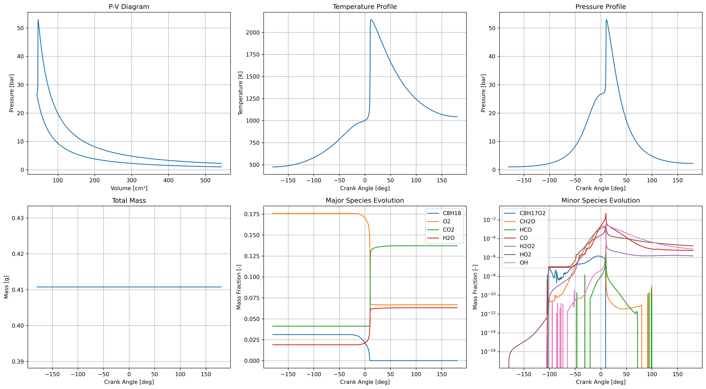
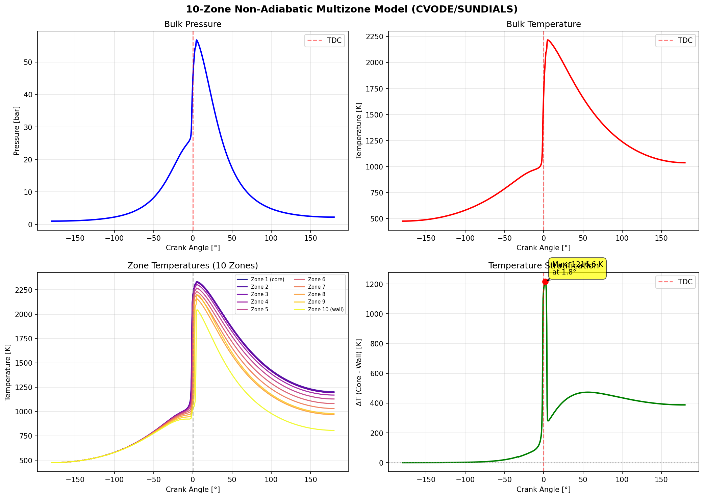

# Engine Simulator

A zero-dimensional (0D) engine simulator for modeling closed-cycle operation with detailed chemical kinetics. The simulator uses a reduced iso-octane mechanism developed by Nissan [1] for efficient yet accurate combustion predictions.

## Features

- Closed-cycle engine simulation (IVC to EVO)
- **Single-zone and multi-zone models** (up to 10+ zones)
- Detailed chemical kinetics using Cantera
- Woschni heat transfer model
- EGR handling with equilibrium composition
- **Temperature stratification modeling** (multizone with heat transfer)
- Interactive plotting of results
- **CVODE solver support** (SUNDIALS) for robust handling of stiff chemistry

## Project Structure

```
.
├── src/               # Core simulation code
│   ├── engine/       # Engine geometry and heat transfer
│   ├── models/       # Physical models (chemistry, etc.)
│   ├── simulation/   # Solver and simulation code
│   └── config/       # Configuration files
├── scripts/          # Runnable scripts
├── data/             # Data files
│   ├── input/        # Input data files
│   ├── mechanisms/   # Reaction mechanisms
│   └── output/       # Simulation results
├── tests/            # Test files
└── docs/             # Documentation
```

## Requirements

- Python 3.9+
- Cantera 2.6+
- NumPy
- SciPy
- Matplotlib
- PyYAML
- tqdm
- **scikits.odes** (optional, recommended for multizone non-adiabatic simulations)

## Quick Start

1. Install dependencies:
```bash
pip install cantera numpy scipy matplotlib pyyaml tqdm
```

2. (Optional) For multizone non-adiabatic simulations, install CVODE solver:
```bash
conda install -c conda-forge scikits.odes sundials
```

3. Run simulation:
```bash
python scripts/run_simulation.py
```

The simulation results will be saved in `data/output/`.

## Configuration

Engine and simulation parameters can be modified in `src/config/default_config.yaml`. Key parameters include:

```yaml
engine:
  geometry:
    bore: 0.086          # Bore diameter [m]
    stroke: 0.086        # Stroke length [m]
    con_rod: 0.1455      # Connecting rod length [m]
    comp_ratio: 12.5     # Compression ratio [-]
    
  operating_conditions:
    speed: 2000          # Engine speed [rpm]
    wall_temp: 400       # Wall temperature [K]

chemistry:
  mechanism: "mechanisms/Nissan_chem.yaml"
  fuel: "C8H18"         # Fuel species (iso-octane)
  phi: 0.7              # Equivalence ratio [-]
  egr: 0.3              # EGR fraction [-]
    
initial_conditions:
  pressure: 1.0e5        # Initial pressure [Pa]
  temperature: 450       # Initial temperature [K]
```

## References

[1] T. Tsurushima, "A new skeletal PRF kinetic model for HCCI combustion," Proceedings of the Combustion Institute, vol. 32, no. 2, pp. 2835-2841, 2009. [DOI: 10.1016/j.proci.2008.06.018](https://doi.org/10.1016/j.proci.2008.06.018)

## Sample Results



The figure shows typical simulation results for a closed-cycle HCCI simulation from IVC (-180°) to EVO (180°), including:
- P-V diagram showing compression, combustion, and expansion
- Temperature and pressure evolution over the cycle
- Major and minor species concentrations
- Mass conservation verification

### Adiabatic vs Non-Adiabatic Comparison

The simulator supports both adiabatic and non-adiabatic operation modes. The adiabatic mode disables heat transfer to the cylinder walls, providing a useful baseline for validating the thermodynamic model and understanding the impact of heat transfer.


The comparison shows:
- Higher peak temperatures in adiabatic operation due to no heat loss
- Higher peak pressures in adiabatic operation
- Differences in expansion behavior due to heat transfer effects

You can run this comparison using:
```bash
python scripts/compare_adiabatic.py
```

### Multizone Temperature Stratification

The multizone model captures temperature stratification effects from wall heat transfer. Each zone evolves independently with its own temperature and composition, while sharing a common pressure.



The multizone results show:
- Temperature stratification between core and wall zones (~1200 K spread at peak)
- Zone-by-zone combustion phasing differences
- More realistic heat transfer modeling with thermal boundary layers

Run the 10-zone non-adiabatic simulation:
```bash
python scripts/test_cvode_multizone.py
```

## Model Formulation

### Key Assumptions
- Uniform temperature across the cylinder (single-zone model)
- Uniform composition and instantaneous mixing (perfect mixing)
- Uniform heat transfer across cylinder walls
- Ideal gas behavior
- No crevice effects
- No blow-by losses

### Governing Equations

The model solves the following conservation equations for a reacting variable volume system:

1. **Mass Conservation**
   ```
   dm/dt = Σ ṁⱼ
   ```
   where:
   - m = total mass in cylinder
   - ṁⱼ = mass flow rates (intake, exhaust, fuel injection)
   - For closed cycle: dm/dt = 0

2. **Species Conservation**
   ```
   dYₖ/dt = Σⱼ (ṁⱼ/m)(Yₖʲ - Yₖᶜʸˡ) + (ΩₖWₖ)/ρ
   ```
   where:
   - Yₖ = mass fraction of species k
   - Yₖʲ = mass fraction of species k in flow j
   - Yₖᶜʸˡ = mass fraction of species k in cylinder
   - Ωₖ = molar production rate of species k
   - Wₖ = molecular weight of species k
   - ρ = gas density

3. **Energy Conservation**
   ```
   dT/dt = (1/mCᵥ)[-p(dv/dt) - m Σₖ uₖ(dYₖ/dt) - (dm/dt)ū - Qw + Σⱼ ṁⱼhⱼ]
   ```
   where:
   - T = temperature
   - Cᵥ = specific heat at constant volume
   - p = pressure
   - v = specific volume
   - uₖ = specific internal energy of species k
   - ū = average specific internal energy
   - Qw = wall heat transfer rate
   - hⱼ = specific enthalpy of flow j

4. **Pressure Evolution** (from ideal gas law)
   ```
   dP/dt = P[(Σᵢ Rᵢ(dYᵢ/dt)/R) + (ṁ/m) + (Ṫ/T) - (V̇/V)]
   ```
   where:
   - P = pressure
   - Rᵢ = specific gas constant of species i
   - R = mixture gas constant
   - V = volume
   - Dots represent time derivatives

### Notes on Implementation

- Index j corresponds to flows (intake, exhaust, fuel injection)
- Index k represents species (33 species in NISSAN PRF mechanism)
- Ω represents molar production rates from chemical kinetics
- W represents molecular weights
- Barred quantities (ū) represent mixture-averaged values
- Wall heat transfer (Qw) is modeled using Woschni correlation
- Volume change (dv/dt) is calculated from slider-crank kinematics
- Chemical kinetics (Ωₖ) are handled by Cantera
- LSODA solver handles the stiff ODE system

### Numerical Solution

The equations are solved using:
- Variable time step solvers (LSODA or CVODE)
- Adaptive error control (rtol=1e-4, atol=1e-6)
- Crank angle as independent variable
- Single-zone state vector: y = [T, V, P, m, Y₁...Y₃₃]
- Multizone state vector: y = [T, P, V, T₁, Y₁...Y₃₃, ..., Tₙ, Y₁...Y₃₃, Y_bulk₁...Y_bulk₃₃]
- Chemical source terms from Cantera
- Thermodynamic properties from NASA polynomials

For extremely stiff multizone systems with heat transfer, the CVODE solver (SUNDIALS) provides superior stability compared to scipy's LSODA.

### Heat Transfer Model

Wall heat transfer is modeled using the Woschni correlation:
- Heat transfer coefficient: h = C·d^(-0.2)·p^(0.8)·T^(-0.53)·w^(0.8)
- Characteristic velocity (w) includes:
  - Mean piston speed term (C1·Up)
  - Combustion term (C2·Vd·T1/p1V1·(p-pm))
- Model coefficients:
  - C1 = 2.28 (compression/expansion)
  - C2 = 0.00324 (combustion)
  - Overall coefficient C = 3.26

### Chemical Kinetics

The simulation uses the Nissan reduced mechanism for iso-octane oxidation:
- 33 species
- Handles both low and high-temperature chemistry
- Validated for HCCI conditions
- Implemented through Cantera's chemical kinetics solver

## Engine Specifications

Current configuration models a single-cylinder engine with:

- Bore: 86 mm
- Stroke: 86 mm
- Connecting rod length: 145.5 mm
- Compression ratio: 12.5:1
- Displacement: 0.5 L

## Operating Conditions

Current simulation capabilities include:
- Engine speed: 2000 rpm
- Initial temperature: 400 K
- Initial pressure: 1.0 bar
- Equivalence ratio: 0.7
- Residual gas fraction: 30%
- Wall temperature: 400 K

## Numerical Implementation

The simulation uses:
- Python with Cantera for chemical kinetics
- LSODA solver for single-zone and adiabatic multizone simulations
- CVODE solver (SUNDIALS) for non-adiabatic multizone simulations
- Adaptive time stepping with:
  - Relative tolerance: 1e-4 to 1e-5
  - Absolute tolerance: 1e-6 to 1e-12
  - Maximum step size: 1e-3 s
  - Initial step size: 1e-6 s

## Current Capabilities

The simulator can predict:
1. Temperature and pressure evolution
2. Chemical species concentrations
3. Heat release rates
4. Wall heat transfer
5. P-V diagram
6. Mass evolution
7. Temperature stratification (multizone model)
8. Zone-by-zone combustion phasing (multizone model)

## Output Visualization

The code generates several plots:
1. Gas temperature vs. crank angle
2. Cylinder pressure vs. crank angle
3. In-cylinder mass vs. crank angle
4. P-V diagram
5. Valve lift profiles

## Limitations

Current limitations include:
1. No direct fuel injection modeling
2. Limited to closed cycle (IVC to EVO)
3. No turbulence modeling
4. Simplified wall heat transfer (Woschni correlation)
5. No inter-zone mass transfer in multizone model

## Future Work

Planned improvements:
1. Direct injection capabilities
2. Full cycle simulation
3. Turbulence effects
4. More detailed heat transfer models
5. Crevice flow modeling
6. Blow-by losses
7. Inter-zone mass transfer for multizone model
