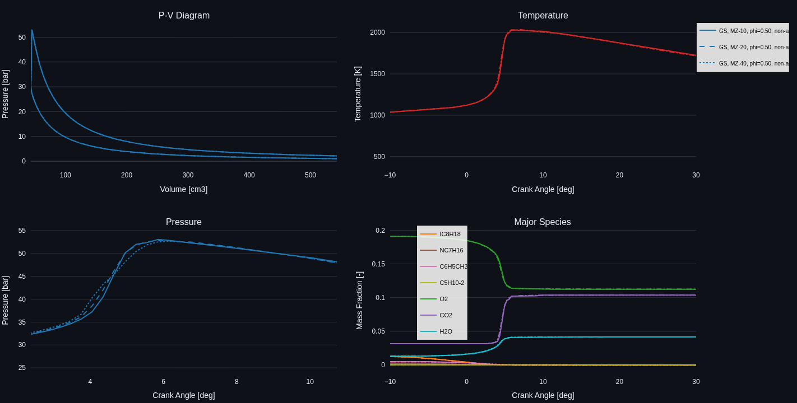
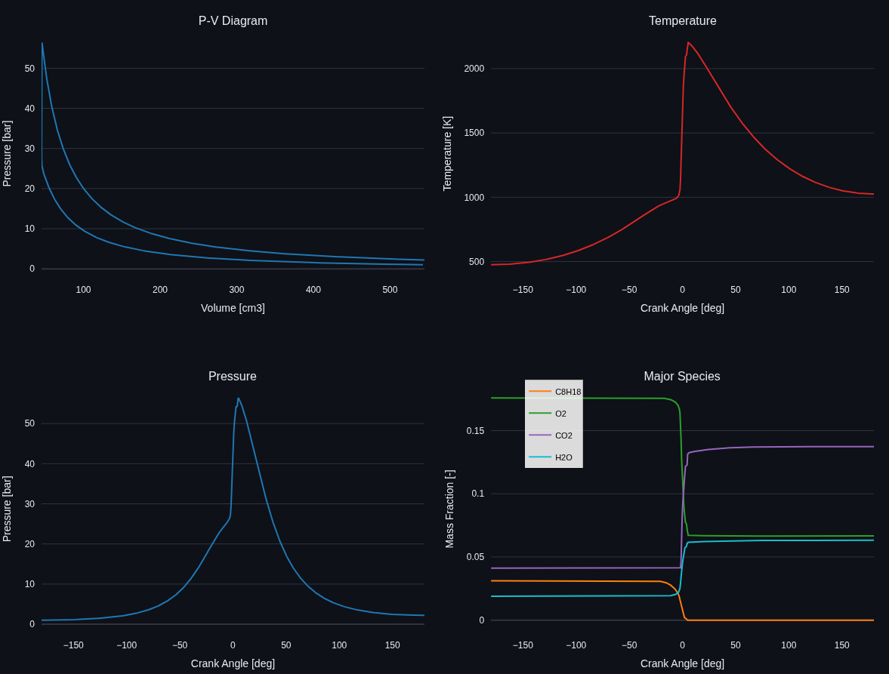
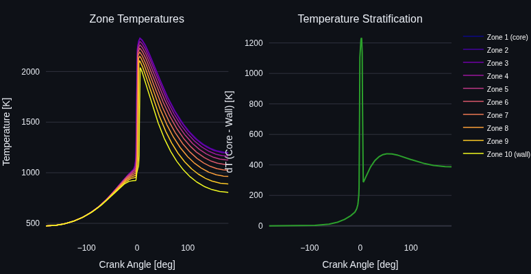
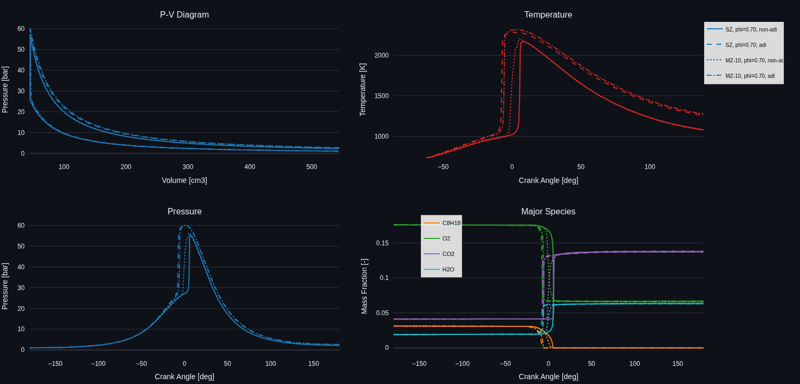

# Engine Simulator

A zero-dimensional (0D) engine cycle simulator with detailed chemical kinetics and an interactive GUI. Built as a learning tool for understanding HCCI combustion, heat transfer, and multi-zone modeling.

## Features

- Single-zone and multi-zone HCCI models with AMECS presets (10/20/40 zones)
- **Adiabatic Core (AC) phenomenological model** — fast single-zone model with Goldsborough ignition delay + Shingne three-step combustion, calibrated to the 10-zone LLNL MZ model
- Two reaction mechanisms: Nissan PRF (33 species) and LLNL Gasoline Surrogate (312 species), including the Mehl et al. gasoline surrogate chemistry [2]
- Cantera ReactorNet solver for large mechanisms — N coupled `IdealGasMoleReactor` instances with GMRES + AdaptivePreconditioner (10 zones x 312 species in ~46 s)
- Woschni heat transfer correlation
- EGR handling with equilibrium composition
- Temperature stratification modeling (multi-zone with wall heat transfer), based on an AMECS-style zonal approach [3]
- Interactive Streamlit GUI with Plotly plots
- Run comparison mode — overlay up to 4 simulations with different configurations
- CVODE solver (SUNDIALS) for robust handling of stiff chemistry
- Jupyter tutorial notebooks
- pytest test suite (50 tests)

## Installation

```bash
# Clone and install as editable package
git clone <repo-url>
cd 0D_engine_simulator
pip install -e .

# Install CVODE solver (recommended)
conda install -c conda-forge scikits.odes sundials

# Install GUI dependencies
pip install -e ".[gui]"

# Install development dependencies (tests, notebooks)
pip install -e ".[dev]"
```

Requires Python 3.9+ and Cantera 2.6+.

## Quick Start

### Interactive GUI

```bash
streamlit run engine_sim/gui/app.py
```

The GUI lets you configure equivalence ratio, EGR fraction, engine geometry, operating conditions, and model type (Single Zone HCCI or Multi Zone HCCI). Run simulations and compare results interactively.

### Command Line

```bash
python scripts/run_simulation.py
```

### Jupyter Notebooks

```
notebooks/01_quickstart.ipynb              # Run your first simulation
notebooks/02_engine_geometry.ipynb         # Slider-crank kinematics and geometry
notebooks/03_multizone_and_heat_transfer.ipynb  # Multi-zone model and Woschni correlation
```

## Project Structure

```
.
├── engine_sim/            # Python package
│   ├── config/            # Default config YAML and path utilities
│   ├── engine/            # Geometry and heat transfer
│   ├── models/            # Chemistry (Cantera wrapper)
│   ├── simulation/        # ODE solver, engine driver, results
│   ├── gui/               # Streamlit app and Plotly plotting
│   └── visualization/     # (reserved)
├── scripts/               # Standalone runnable scripts
├── notebooks/             # Jupyter tutorial notebooks
├── tests/                 # pytest test suite
├── data/
│   ├── mechanisms/        # Cantera reaction mechanisms
│   └── output/            # Simulation output files
└── pyproject.toml         # Package metadata and dependencies
```

## Configuration

Engine and simulation parameters can be set via the GUI sidebar, or modified in `engine_sim/config/default_config.yaml`:

```yaml
engine:
  geometry:
    bore: 0.086          # Bore diameter [m]
    stroke: 0.086        # Stroke length [m]
    con_rod: 0.1455      # Connecting rod length [m]
    comp_ratio: 12.5     # Compression ratio [-]

  operating_conditions:
    speed: 2000          # Engine speed [rpm]
    wall_temp: 400       # Wall temperature [K]

chemistry:
  mechanism: "mechanisms/Nissan_chem.yaml"
  fuel: "C8H18"         # Fuel species (iso-octane)
  phi: 0.7              # Equivalence ratio [-]
  egr: 0.3              # EGR fraction [-]

initial_conditions:
  pressure: 1.0e5        # Initial pressure [Pa]
  temperature: 450       # Initial temperature [K]
```

## Testing

```bash
# Run all tests
pytest

# Skip slow tests (chemistry initialization)
pytest -m "not slow"

# Skip tests requiring CVODE
pytest -m "not cvode"
```

## Model Formulation

### Governing Equations

The simulator solves conservation equations for a reacting variable-volume system:

1. Energy conservation — temperature evolution from compression work, chemical heat release, and wall heat transfer
2. Species conservation — mass fraction evolution from chemical kinetics
3. Pressure evolution — derived from the ideal gas equation of state
4. Volume kinematics — slider-crank mechanism

Single-zone state vector: `[T, V, P, m, Y₁...Yₙ]`

Multi-zone state vector: `[T_bulk, P, V, T₁, Y₁...Yₙ, ..., Tₖ, Y₁...Yₙ, Y_bulk]`

### Implementation Equations

The equations below match the implemented right-hand side in `engine_sim/simulation/solver.py` and `engine_sim/engine/heat_transfer.py`.

Crank-angle and volume kinematics:

```text
omega = 2*pi*rpm/60
theta(t) = theta_start + omega*t
dV/dt = -volume_rate(theta, rpm)
```

Wall heat transfer (simplified Woschni form in code):

```text
Up = 2*stroke*rpm/60
h = C_scale*C * V^vol_exp * (P/1000)^press_exp * T^temp_exp * (Up + vel_offset)^vel_exp
Q_wall = h*A_total*(T - T_wall)
```

Single-zone ODE system:

```text
dT/dt = (-P*(dV/dt) + Q_chem*V - Q_wall) / (m*cv)
dP/dt = P*((dT/dt)/T - (dV/dt)/V)
dY_k/dt = (W_k*omega_dot_k)/rho
```

Multi-zone ODE system:

```text
M_i = M_total*f_i
V_i = M_i/rho_i
Ydot_k,i = (W_k*omega_dot_k,i)/rho_i

dT_bulk/dt =
  ( -M_total*R_bulk*T_bulk/V * (dV/dt)
    - Q_wall
    - sum_i M_i*sum_k(Ydot_k,i*u_k,i) ) / (M_total*Cv_bulk)

dP/dt = P*((dT_bulk/dt)/T_bulk - (dV/dt)/V)

dT_i/dt =
  ( dP/dt*V_i
    - Q_wall*w_i
    - M_i*sum_k(Ydot_k,i*h_k,i) ) / (M_i*Cp_i)

dY_k,bulk/dt = (1/M_total)*sum_i(M_i*Ydot_k,i)
```

Zone mass and heat-loss weighting (Kodavasal et al. profiles):

```text
f_i  — zone mass fraction (Fig. 2, Kodavasal 2013)
C_i  — zone heat-loss multiplier (Fig. 3b, Kodavasal 2013)
w_i  = (f_i * C_i) / sum_j(f_j * C_j)   [supported for 10, 20, 40 zones]
```

The LLNL gasoline runs use a 4-component surrogate blend (iso-octane / n-heptane / toluene / 2-pentene) with detailed kinetics from Mehl et al. [2]. Zone mass fractions and heat-loss multipliers for 10, 20, and 40 zones follow the published profiles from Kodavasal et al. [3].

### Multi-Zone Model

The cylinder is divided into zones, each with a fixed mass fraction, its own temperature and composition, a common shared pressure, and heat loss only to the cylinder wall (no inter-zone heat or mass transfer). Differential wall heat loss across zones produces thermal stratification that affects combustion phasing. Zone mass fractions and heat-loss multipliers are taken directly from the published profiles in Kodavasal et al. [3] for 10, 20, and 40 zones.

The figure below compares 10-, 20-, and 40-zone simulations with the LLNL 312-species gasoline surrogate mechanism (φ = 0.50, non-adiabatic, 2000 RPM). Curves are nearly indistinguishable, confirming that the zone-count discretization is consistent across all three supported configurations.



### Heat Transfer

Wall heat transfer uses the Woschni correlation with coefficients C₁ = 2.28 (compression/expansion) and C₂ = 0.00324 (combustion).

### Numerical Solution

- Small mechanisms (< 100 species): CVODE solver (SUNDIALS BDF method) when available, with scipy LSODA as fallback.
- Large mechanisms (100+ species): Auto-dispatches to Cantera's ReactorNet solver, which uses CVODES with analytical Jacobians computed in C++. For multizone, N `IdealGasMoleReactor` instances are coupled via pressure-equilibration walls and driven by proportional piston velocity callbacks. GMRES with `AdaptivePreconditioner` avoids the O(N³) cost of dense linear solves.

## Engine Specifications (Default)

| Parameter | Value |
|-----------|-------|
| Bore | 86 mm |
| Stroke | 86 mm |
| Connecting rod | 145.5 mm |
| Compression ratio | 12.5:1 |
| Displacement | ~0.5 L |

## GUI Screenshots

### Single Zone HCCI Simulation


### Multi Zone HCCI Simulation



### Temperature Stratification



### Run Comparison Mode

Overlay up to 4 simulations with different configurations. Each run is distinguished by line style (solid, dashed, dotted, dash-dot).



### Adiabatic Core (AC) Phenomenological Model

The AC model provides a fast (~ms) alternative to the full ODE-based solvers, based on Shingne et al. [4, 5]. It uses two steps in sequence:

**1. Ignition timing (θ_IGN)**

A direct polynomial regression predicts θ_IGN from operating conditions:

```
log(−θ_IGN) = f(RPM/2000, φ/0.5, RGF/0.4, P_TDC_bar/50)   [2nd-order, 15 terms]
```

Fitted to 114 valid points from a 120-point Latin Hypercube Sampling (LHS) sweep over:

| Parameter | Range |
|-----------|-------|
| RPM | 800–4000 |
| φ (equiv. ratio) | 0.20–0.80 |
| RGF | 0.20–0.60 |
| P_IVC | 1.0–2.5 bar |

Each sweep point was run with the 10-zone MZ model using the LLNL 312-species gasoline surrogate. Fit quality: R²=0.80, RMS≈3.4 °CA.

A Livengood-Wu/Goldsborough fallback path (with a 10-parameter δE_AC polynomial, R²=0.54) is retained and can be enabled by setting `use_direct_ign_fit: false` in `fitted_ac_params.yaml`.

**2. Burn duration and MFB profile (Shingne et al. [5])**

Crank-angle milestones (θ_25, θ_50, θ_75) are predicted from quadratic power-law correlations in (θ_IGN, φ', RPM, P_TDC):

```
Δθ_IGN→25 = |a1·θ² + a2·θ + a3| · φ_r^x1 · spd^x2 · P_r^x3
```

Equations 1–3 are refitted to the same MZ sweep (R²=0.97, 0.89, 0.95 respectively). The MFB profile is a three-stage model: exponential ITHR (0→25%), Wiebe (25→75%), and linear tail (75→100%).

**3. Combustion efficiency**

C_eff is predicted as a hyperbolic function of peak adiabatic temperature, with power-law corrections for φ', RPM, and P_TDC (R²=0.97).

**Calibration workflow**

```bash
# 1. Generate the MZ training data (120 points, ~14 workers, ~30 min)
python scripts/calibration/01_run_sweep.py

# 2. Fit all correlations and save YAML
python scripts/calibration/02_fit_params.py

# Fitted parameters are auto-loaded from data/calibration/fitted_ac_params.yaml
```

## Limitations

- Closed cycle only (IVC to EVO)
- No direct injection modeling
- No turbulence modeling
- No inter-zone mass transfer
- No crevice or blow-by losses

## References

[1] T. Tsurushima, "A new skeletal PRF kinetic model for HCCI combustion," *Proceedings of the Combustion Institute*, vol. 32, no. 2, pp. 2835-2841, 2009. [DOI: 10.1016/j.proci.2008.06.018](https://doi.org/10.1016/j.proci.2008.06.018)

[2] M. Mehl, W. J. Pitz, C. K. Westbrook, and H. J. Curran, "Kinetic modeling of gasoline surrogate components and mixtures under engine conditions," *Proceedings of the Combustion Institute*, vol. 33, no. 1, pp. 193-200, 2011. [DOI: 10.1016/j.proci.2010.05.027](https://doi.org/10.1016/j.proci.2010.05.027)

[3] J. Kodavasal, M. J. McNenly, A. Babajimopoulos, S. M. Aceves, D. N. Assanis, M. A. Havstad, and D. L. Flowers, "An accelerated multi-zone model for engine cycle simulation of homogeneous charge compression ignition combustion," *International Journal of Engine Research*, vol. 14, no. 5, pp. 416-433, 2013. [DOI: 10.1177/1468087413482480](https://doi.org/10.1177/1468087413482480)

[4] P. S. Shingne, R. J. Middleton, D. N. Assanis, C. Borgnakke, and J. B. Martz, "A thermodynamic model for homogeneous charge compression ignition combustion with recompression valve events and direct injection: Part I—Adiabatic core ignition model," *International Journal of Engine Research*, vol. 18, no. 7, pp. 657–676, 2017. [DOI: 10.1177/1468087416664635](https://doi.org/10.1177/1468087416664635)

[5] P. S. Shingne, J. Sterniak, D. N. Assanis, C. Borgnakke, and J. B. Martz, "Thermodynamic model for homogeneous charge compression ignition combustion with recompression valve events and direct injection: Part II—Combustion model and evaluation against transient experiments," *International Journal of Engine Research*, vol. 18, no. 7, pp. 677–700, 2017. [DOI: 10.1177/1468087416665052](https://doi.org/10.1177/1468087416665052)
